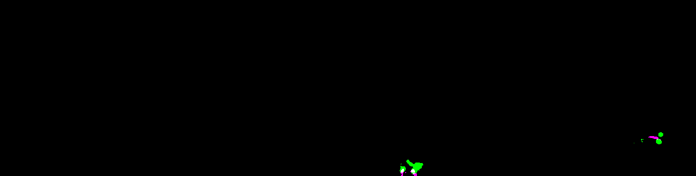

<div align="center">

# Neuro-SAM 
#### Foundation Models from Dendrite and Dendritic Spine Segmentation

[](https://github.com/pre-commit/pre-commit)
[](https://pytorch.org/get-started/locally/)
[](https://wandb.ai/site)

This project demonstrates an interactive UI to segment dendrites and dendritic spines.
The model of choice is SAMv2 and the framework used is pytorch.



</div>

### 📝  Table of Contents

- [Neuro-SAM](#neuro-sam)
  - [📑 Table of Contents](#--table-of-contents)
  - [🧠 Overview](#-overview)
  - [📦 Built With](#-built-with)
  - [📂 Repository Structure](#-repository-structure)
  - [🚀 Installation](#-installation)
  - [📊 Usage](#-usage)
  - [🛠 Workflow](#-workflow)
  - [🧑‍💻 Model Training](#-model-training)
  - [📁 Data Format](#-data-format)
  - [📄 License](#-license)
  - [📬 Contact](#-contact)


### 🧠 Overview

Neuro-SAM provides an end-to-end pipeline for analyzing neural structures from 3D microscopy data, featuring:

- **Path Tracing**: Waypoint-based A* pathfinding
- **Dendrite Segmentation**: SAM2-based dendrite segmentation
- **Smart Spine Detection**: Multi-view analysis for spine detection
- **Spine Segmentation**: Individual spine segmentation using trained SAM2 model

### 📦 Built With

[PyTorch](https://pytorch.org) - an open-source machine learning library for Python, widely used for deep learning applications.

[Segment Anything Model](https://segment-anything.com) - a foundation model used for segmentation built by Meta AI.

[Weights and Biases](https://wandb.ai/site) - a tool for tracking and visualizing machine learning experiments.

[Visual Studio Code](https://code.visualstudio.com/) - a code editor redefined and optimized for building applications.

[FAU High Performance Computing](https://doc.nhr.fau.de/) - a high-performance computing cluster at Friedrich-Alexander-Universität Erlangen-Nürnberg.

### 📁 Repository Structure

```
Neuro-SAM/
├── Train-SAMv2/                    # SAM2 training infrastructure
│   ├── sam2/                       # SAM2 model implementation
│   ├── checkpoints/                # Model checkpoints
│   ├── results/                    # Trained model outputs
│   ├── utils/                      # Training utilities
│   ├── train_dendrites.py         # Dendrite model training
│   └── train_spines.py            # Spine model training
├── brightest_path_lib/             # Advanced pathfinding algorithms
│   ├── algorithm/                  # A* and waypoint search implementations
│   ├── cost/                       # Cost function definitions
│   ├── heuristic/                  # Heuristic functions
│   ├── visualization/              # Path visualization tools
│   └── ...
├── napari_utils/                   # Napari plugin components
│   ├── main_widget.py             # Main interface with anisotropic scaling
│   ├── path_tracing_module.py     # Interactive path tracing
│   ├── segmentation_module.py     # Dendrite segmentation interface
│   ├── spine_detection_module.py  # Spine detection with smart tracking
│   ├── spine_segmentation_module.py # Individual spine segmentation
│   └── visualization_module.py    # Path management and visualization
└── neuro_sam_plugin.py            # Main plugin entry point
```

### 🚀 Installation

#### Prerequisites

- Python 3.10+
- CUDA-compatible GPU (recommended)
- Conda/Miniconda

#### Environment Setup

1. **Clone the repository:**
```bash
git clone https://github.com/nipunarora8/Neuro-SAM.git
cd Neuro-SAM
```

2. **Create conda environment:**
```bash
conda env create -f environment.yml
conda activate sam2
```

3. **Download SAM2 checkpoints:**
```bash
cd Train-SAMv2/checkpoints
bash download_ckpts.sh
```

### 📊 Usage

#### Quick Start

```python
from neuro_sam_plugin import run_neuro_sam

# Launch with default spacing (94nm x 94nm x 500nm)
viewer = run_neuro_sam(image_path="your_image.tif")

# Launch with custom voxel spacing
viewer = run_neuro_sam(
    image_path="your_image.tif",
    spacing_xyz=(100.0, 100.0, 300.0)  # X, Y, Z spacing in nm
)
```

#### Command Line Interface

```bash
# Basic usage
python neuro_sam_plugin.py --image_path /path/to/your/image.tif

# Custom spacing
python neuro_sam_plugin.py --image_path image.tif \
    --x-spacing 100.0 --y-spacing 100.0 --z-spacing 300.0

# Load benchmark dataset
python neuro_sam_plugin.py
```

### 🔬 Workflow

#### 1. **Configure Voxel Spacing**
Set accurate X, Y, Z voxel spacing in the "Path Tracing" tab for proper anisotropic scaling:
- Typical two-photon: 94nm × 94nm × 500nm
- Confocal: varies by objective and zoom

#### 2. **Trace Dendritic Paths**
- Click waypoints along dendrite structures
- Algorithm automatically finds optimal brightess paths

#### 3. **Segment Dendrites**
- Load pre-trained SAMv2 dendrite model
- Segment individual path with SAMv2

#### 4. **Detect Spines**
- Smart multi-view detection using tube data generation
- Angle-based matching between 2D and tubular views

#### 5. **Segment Spines**
- Fine-grained spine segmentation using specialized SAMv2 model
- Dendrite mask overlay to suppress background signal
- Manual point extension across frames
- Contrasting color system for visualization

### 🔧 Model Training

#### Dendrite Model
```bash
cd Train-SAMv2
python train_dendrites.py --ppn 20 --pnn 10 --batch_size 32 --model_name "small"
```

#### Spine Model  
```bash
python train_spines.py --model_name "small" --batch_size 16
```

### 📁 Data Format

#### Input Requirements
- **Image Format**: TIFF format
- **Dimensions**: 3D volumes (Z×Y×X) 
- **Bit Depth**: 8-bit or 16-bit grayscale
- **Size**: Tested up to 2048×2048×500 voxels

#### Output Formats
- **Paths**: NumPy arrays with coordinates
- **Masks**: Binary TIFF volumes

### 📄 License

This project is licensed under the MIT License - see the [LICENSE](LICENSE) file for details.


#### Useful VSCode Extensions

- [Remote Explorer](https://marketplace.visualstudio.com/items?itemName=ms-vscode.remote-explorer) - Open projects on remote servers.
- [Log Viewer](https://marketplace.visualstudio.com/items?itemName=berublan.vscode-log-viewer) - A log monitoring extension.
- [Black Formatter](https://marketplace.visualstudio.com/items?itemName=ms-python.black-formatter) - Python auto code formatter.
- [Markdown All in One](https://marketplace.visualstudio.com/items?itemName=yzhang.markdown-all-in-one) - Markdown preview and editing.

### 📬  Contact

Nipun Arora - nipun.arora@fau.de

---
<div align="center">
<b>Made with ♥️ at Anki Lab 🧠✨</b>
</div>